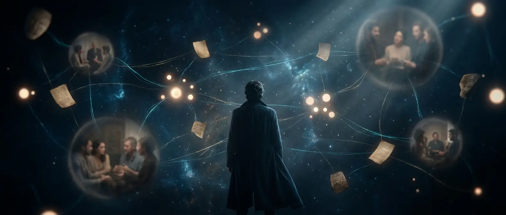
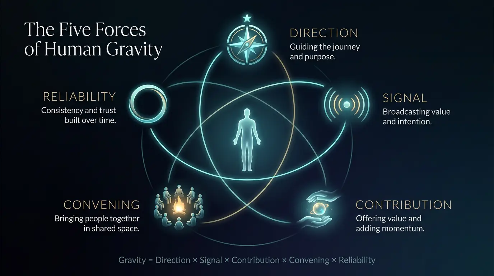
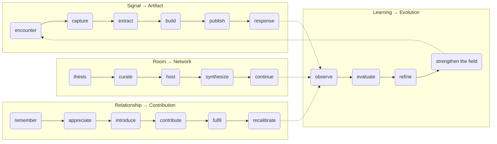

<!-- Hero visual — dropped in when the raster asset is generated. See assets/README.md for the prompt + provenance. -->
<p align="center">
  
</p>

<h1 align="center">Starlight Gravity Engine</h1>

<p align="center"><strong>Human and agentic engineering for turning meaningful encounters into shared intelligence, useful artifacts, trusted relationships, and rooms people want to return to.</strong></p>

<p align="center">
  <a href="#fifteen-minute-quick-start">Quick start</a> ·
  <a href="MANIFESTO.md">Manifesto</a> ·
  <a href="CANON.md">Canon</a> ·
  <a href="ARCHITECTURE.md">Architecture</a> ·
  <a href="docs/four-loops.md">The four loops</a>
</p>

<p align="center">
  
  
  
  
  
</p>

---

## The problem is fragmentation

The tools you already own each solve one slice of a life that compounds — and
none of them talk to each other:

- A **CRM** remembers people, but only as a sales funnel. It has no idea what you
  are _for_, and it would happily rank your friends.
- A **content engine** ships posts, but forgets the encounter that sparked them
  and the person who deserves the reply.
- A **PKM / second brain** hoards notes, but never turns a note into a kept
  promise or a warm introduction.
- A **community platform** hosts the room, but the intelligence evaporates when
  everyone logs off.

Each is a fragment. The thing that actually compounds a life — the ideas _and_
the relationships _and_ the rooms _and_ the opportunities, moving together — has
no home. The Gravity Engine is that home.

## The five forces of human gravity

<p align="center">
  
</p>

> **Gravity = Direction × Signal × Contribution × Convening × Reliability**

It is a **product**, not a sum: a zero in any force collapses the whole. You
raise gravity by raising your weakest force, not by maxing your strongest.

| Force            | The question it answers                 |
| ---------------- | --------------------------------------- |
| **Direction**    | Are you moving somewhere worth joining? |
| **Signal**       | Are you capturing what you notice?      |
| **Contribution** | Do you give before you ask?             |
| **Convening**    | Do you bring people together?           |
| **Reliability**  | Do your promises come true?             |

## Who does what — the human/agent division

**Human engineering creates gravity. Agentic engineering makes it compound.**

| Agents increase | Agents never manufacture             |
| --------------- | ------------------------------------ |
| Memory          | Judgment                             |
| Consistency     | Presence                             |
| Preparation     | Generosity                           |
| Transformation  | Trust                                |
| Cycle frequency | Relationship intent · Human identity |

The agent removes friction from real human acts. It does not fake the acts. The
line is enforced in code, not just promised in prose — see [CANON.md](CANON.md).

## The four compounding loops



Full walk-through: [docs/four-loops.md](docs/four-loops.md).

## Fifteen-minute quick start

No cloud account. No install beyond Node. The Local Engine has **zero runtime
dependencies**.

```bash
# 1. Get the engine
git clone https://github.com/frankxai/starlight-gravity-engine
cd starlight-gravity-engine

# 2. Create your field (writes .gravity/ and DIRECTION.md)
node packages/cli/src/bin.ts init

# 3. Fill in DIRECTION.md — your statement, themes, values.
#    (Editing the file is enough; the engine syncs it automatically.)

# 4. Capture your first real encounter
node packages/cli/src/bin.ts capture --note "Met Ada at the local-first dinner. \
Big insight: sovereignty is the moat for agentic systems. I'll send her the \
draft essay by Friday." --save

# 5. Read your brief — gravity score, forces, open promises, signals
node packages/cli/src/bin.ts brief

# 6. Seven days later, run the learning loop
node packages/cli/src/bin.ts review
```

Every `capture` returns five things — your **strongest signal**, one **artifact
opportunity**, one **follow-through**, one **appreciation or introduction**, and
one **room theme** — each of which is yours to approve or decline. The engine
never acts alone.

Prefer no install at all? The [Markdown Starter](starter-packs/markdown/) runs
the exact same loop with any capable AI agent and a folder of files. Full path:
[QUICKSTART.md](QUICKSTART.md).

## Three ways to run it

| Mode                   | You need             | You get                                                                          |
| ---------------------- | -------------------- | -------------------------------------------------------------------------------- |
| **Markdown Starter**   | Any capable AI agent | The loops as prompts + files. Zero install.                                      |
| **Local Engine**       | Node.js 22+          | A cross-platform CLI, typed schemas, local-first storage, zero deps.             |
| **Connected Operator** | Optional adapters    | SIS, Supabase, Notion, Calendar, Telegram, n8n, GitHub — opt-in, never required. |

## Privacy & non-impersonation, up front

- **Private by default.** Every captured record is `private_context` until you
  decide otherwise. Publication is a separate, explicit human act.
- **No impersonation.** Agents never write or send as you without approval.
- **No rankings, no psychoanalysis.** The person record has no score field — it
  is structurally impossible to add one. Speculation about attraction, diagnosis,
  or hidden intent is refused at capture.
- **You can leave.** `export` and `destroy` are first-class. The bytes are yours.

Details: [docs/privacy-consent-and-sovereignty.md](docs/privacy-consent-and-sovereignty.md).

## How it composes with the Starlight stack

The Gravity Engine is a **standalone vertical built on SIP** — the Starlight
Intelligence Protocol. It composes with, but never requires, the rest of the
stack:

- **[Starlight Intelligence System](https://github.com/frankxai/Starlight-Intelligence-System)** — the sovereign substrate (memory, identity, provenance, governance). Gravity attests to it; it does not live inside it.
- **[Creator Intelligence System](https://github.com/frankxai/creator-intelligence-system)** — the signal-to-artifact protocol the publish loop draws on.
- **[Agentic Creator OS](https://github.com/frankxai/agentic-creator-os)** — executable creative workflows for the _build_ step.

Every published artifact carries a `Built on SIP` attestation. See
[docs/integrations.md](docs/integrations.md).

## For founders, creators, and community builders

- **Founders** — turn every investor, hire, and customer conversation into
  compounding signal, kept promises, and warm intros. → [examples/founder](examples/founder/)
- **Creators** — turn encounters and DMs into artifacts on a reliable cadence,
  without the CRM sludge. → [examples/creator](examples/creator/)
- **Community builders** — turn a thesis into a room, and a room into a network
  that keeps producing after everyone goes home. → [examples/community](examples/community/)

## Repository map

```
schemas/        JSON Schema contracts (the wire format)
packages/core/  The engine: gravity scoring, capture, storage, attestation (zero deps)
packages/cli/   The starlight-gravity CLI
agents/         Five role definitions (signal-steward, field-editor, ...)
skills/         Six loop skills (gravity-capture, gravity-brief, ...)
commands/       CLI command references
starter-packs/  Markdown / Claude Code / Codex / generic on-ramps
examples/       Worked fields for founder, creator, community
docs/           Human & agentic engineering, the four loops, privacy, metrics
```

## Status

**v0.1 — Field Edition.** A small, verified, working core over grand language.
See the draft PR for the architecture decisions, verification evidence, and
current limitations. Contributions welcome — start with
[CONTRIBUTING.md](CONTRIBUTING.md).

---

<p align="center"><em>Built on SIP — Starlight Intelligence Protocol · substrate: starlightintelligence.org/protocol v1.1.1 · © 2026 Frank Riemer · MIT</em></p>
