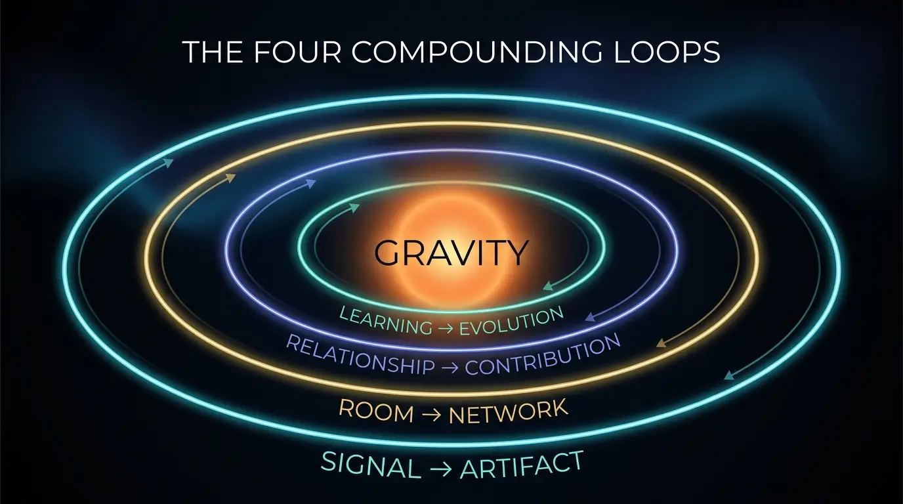
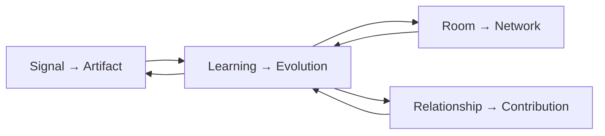

# The four compounding loops

Gravity compounds because these loops feed each other. Each has a human core and
an agentic accelerant, and each maps to concrete commands and entities in the
engine.

---

## 1. Signal → Artifact

**encounter → capture → extract → build → publish → response**

You meet someone, read something, notice something. You capture it before it
evaporates. The engine extracts the strongest signal, you build it into an
artifact, you publish it (a human act, with provenance), and the response —
replies, reshares, new encounters — becomes fresh signal.

- **Human core:** noticing, and the taste to build the right thing.
- **Agentic accelerant:** turning a scrawled note into a draft by morning;
  remembering the signal months later.
- **Engine:** `capture` → `signal`; `publish` → `artifact` + SIP attestation.
- **Force it raises:** Signal, then Contribution when you ship.

## 2. Room → Network

**thesis → curate → host → synthesize → continue**

A room starts as a _thesis_, never a guest list — why these people, why now. You
curate, host, and then synthesize what the room produced. The synthesis and its
follow-ups turn a one-night gathering into a continuing collaboration.

- **Human core:** the thesis, the hosting, the generosity of convening.
- **Agentic accelerant:** suggesting who fits the thesis (from consented
  context), preparing you, capturing the synthesis.
- **Engine:** `room propose` → `room` (thesis, invitees, synthesis, follow-ups).
- **Force it raises:** Convening.

## 3. Relationship → Contribution

**remember → appreciate → introduce → contribute → fulfil → recalibrate**

You remember the specifics of a person (observable, consented — never a dossier).
You appreciate them concretely. You introduce them to someone they'd genuinely
benefit from — with consent from both. You contribute, you keep the promise you
made, and you recalibrate as the relationship grows.

- **Human core:** genuine care, judgment about who to connect, keeping your word.
- **Agentic accelerant:** never forgetting a name or a promise; surfacing the
  timely appreciation; nudging a stale commitment before it breaks.
- **Engine:** `person-context`, `introduction` (double opt-in), `commitment`,
  `follow-through --fulfil`.
- **Force it raises:** Contribution and Reliability.

## 4. Learning → Evolution

**observe → evaluate → refine → strengthen the field**

Weekly, you look at the whole field. What compounded? Which force is weakest?
What should change? The engine computes your gravity delta and points you at the
single move that would raise the floor.

- **Human core:** honesty about what's working; the discipline to run the loop.
- **Agentic accelerant:** the score, the delta, the weakest-force recommendation.
- **Engine:** `review` → writes `reviews.json`, reports the delta and weakest
  force.
- **Force it raises:** all of them, indirectly — this is the meta-loop.

---

## How they compound

A captured signal (L1) names a person (L3) who belongs in a room (L2); the room's
synthesis becomes an artifact (L1) and three introductions (L3); the weekly
review (L4) notices your Convening force is climbing and your Reliability is
slipping, so next week you close promises before hosting again. No single loop
creates gravity. The **product** of all four does.
