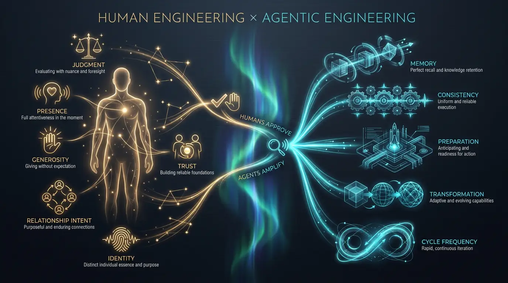

# Human engineering

> Human engineering creates gravity.

The forces are human. No agent can generate them for you — it can only reduce the
friction that keeps you from expressing what's already yours. This is the half of
the system that runs on you.

## Direction — be legible

People join a vector, not a fog. If nobody can say in one sentence what you're
moving toward, you have no gravity well. Direction is not a five-year plan; it is
a legible present tense: _this is what I'm building, these are the threads, these
are my values._

- Write it down (`DIRECTION.md`). Keep it to a statement, a horizon, a few
  themes, and your values.
- Revise it out loud with people. A direction others can repeat is a direction
  others can pull toward.

## Signal — notice, and keep

Attention that evaporates compounds nothing. The people with gravity are not more
observant in the moment; they _keep_ what they observe. A five-line note after a
dinner, captured that night, is worth more than a perfect memory you never wrote
down.

- Capture within hours, while it's specific.
- Observable only. What was said and seen — never what you imagine someone felt.

## Contribution — give first

Generosity is the only durable form of reach. Every ask spends relationship
capital; every genuine contribution builds it. The introductions you make, the
promises you keep, the work you ship for free — these are the deposits.

- Make it specific and unrequested. A timely, concrete appreciation lands harder
  than a hundred generic ones.
- Introduce for _their_ benefit, not yours, and always with consent.

## Convening — host

An attendee consumes a room; a host creates a field. Bringing the right people
together around something true is one of the highest-leverage acts available to a
human, and almost nobody does it consistently.

- Start from a thesis, not a guest list.
- Synthesize afterward. The value of a room is what continues after it ends.

## Reliability — keep your word

Trust is the interest rate on every relationship you have. One broken promise
quietly discounts every future one. Reliability is unglamorous and decisive: it
is the force most people leak, and the easiest to compound with a little help.

- Name promises concretely ("send the deck by Friday"), not vaguely ("follow
  up").
- Close overdue loops before opening new ones.

## The discipline

None of this is complicated. It is just hard to sustain — which is exactly where
[agentic engineering](agentic-engineering.md) comes in. The machine keeps the
loop turning when your attention drifts; you supply the judgment, presence, and
care that were always the point.
